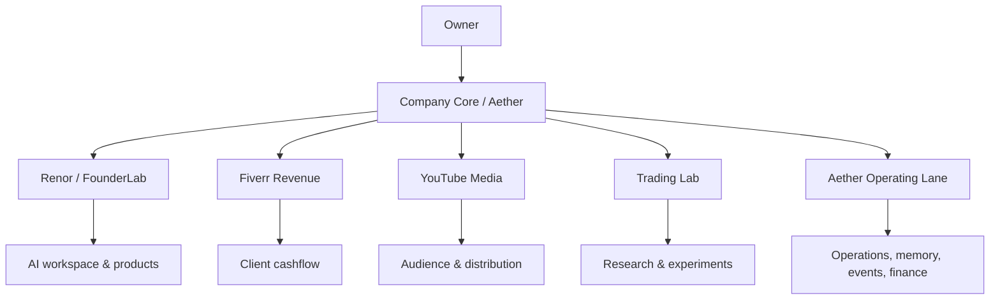

<div align="center">

# FounderNexora

### Building useful AI-native products — and the operating system behind them.

**FounderNexora** is the public company hub for a growing set of products, research systems, media, and revenue engines coordinated through a durable Company OS.

[](#current-state)
[](#company-os)
[](#repository)
[](LICENSE)

</div>

---

## Why this exists

Most AI projects are isolated tools.

FounderNexora is being built around a different idea:

> **Products should share durable memory, proven workflows, evidence, and infrastructure — without collapsing into one giant monolith.**

The company is growing as a federation of specialized stations. Each station can use the best model, tool, or runtime for its job while Company Core preserves what the organization learns.

The long-term aim is simple to say and difficult to build well:

**turn real problems into tested solutions, preserve the learning, and compound the useful assets.**

---

## Company map



### The five stations

| Station | Role | Current direction |
| --- | --- | --- |
| **Aether / Company Core** | Memory, events, work orders, controls, finance, improvement loops | Internal operating substrate |
| **Renor / FounderLab** | AI workspace, coding, building, voice, connectors, product experience | Public product + intelligence workspace |
| **Fiverr Revenue** | Legitimate client work and near-term cashflow | Revenue station |
| **YouTube Media** | Original content, audience, distribution, documentation | Media station |
| **Trading Lab** | Evidence-based market research and paper experimentation | Research station |

These are **operating stations**, not five public products. The public product portfolio will remain smaller and clearer than the internal company architecture.

---

## Company OS

The company is being designed so that important knowledge does not disappear when a chat ends, a model changes, or an external worker is replaced.

Core principles:

- **one fact → one canonical owner → projections everywhere else**
- **agents boot from durable company state, not chat memory**
- **resume from checkpoint; do not restart completed work**
- **no critical company knowledge lives only inside one AI vendor**
- **evidence before "done"**
- **federate first; merge systems only when the evidence justifies it**
- **observe → propose → review → apply → measure → promote/revert**

The canonical Company OS architecture and continuity rules live in the Aether repository under:

`Company-System-Memory/`

---

## Current state

### Shipped / real today

- A functioning FounderNexora public website foundation.
- FounderLab/Renor application with AI Chat, Code AI, Builder, YouTube tooling, notes, tasks, workspaces, connectors and voice foundations.
- Aether company substrate with append-only events, work orders, budgets, ledger, structured/vector memory, agent runtime and control-plane foundations.
- Durable engineering memory and handoff systems in both Aether and FounderLab/Renor.
- Company Continuity v0.1: portfolio memory, station registry, roadmap, handoff protocol, portability standard and engineering policy.

### Being improved

- cross-station Station Contract
- Smart Context Router
- agent continuation commands
- Grok/external-worker portability
- unified owner Control Center
- memory-drift elimination
- repository/branch hygiene
- public company identity and website architecture

### Not claimed yet

We do **not** claim:
- fully autonomous company operation
- verified live trading edge
- large user/revenue numbers
- production maturity for unverified systems
- partnerships or capabilities that have not been proven

Truthful status is part of the product.

---

## Ground → Moon roadmap

```mermaid
flowchart LR
    G[Ground
Preserve truth]
    F[Foundation
Standardize stations]
    W[Wiring
Continuity engine]
    N[Nervous system
Events + adapters]
    M[Memory
Smart context]
    C[Control
Owner cockpit]
    L[Learning
Measured improvement]
    AU[Autonomy
Proven envelopes]
    P[Product
Dogfood Company OS]
    E[Ecosystem
External platform]
    MO[Moon
Compound intelligence]

    G --> F --> W --> N --> M --> C --> L --> AU --> P --> E --> MO
```



The roadmap advances by **evidence**, not by dates or hype.

---

## Renor

**Renor** is the public-facing evolution of FounderLab.

The internal FounderLab identifiers stay stable where renaming would break storage, credentials, deployments, or compatibility. Renor is the presentation/product identity; FounderLab remains part of the engineering origin and internal implementation history.

The goal is not another generic chatbot.

The goal is an intelligent workspace that can understand work, use tools, build, code, coordinate and remember.

---

## Aether

**Aether** is the internal operating substrate.

It already contains foundations for:

- append-only event history
- work orders
- budgets and autonomy envelopes
- double-entry ledger
- structured + vector memory
- agent runtime
- model gateway
- approvals
- control plane
- self-improvement proposals
- recovery and auditability

Aether is deliberately boring where infrastructure should be boring, and ambitious where organizational design can create leverage.

---

## Engineering standard

The company engineering policy is built around:

**truthful state · durable memory · excellent execution · measured learning · controlled autonomy · recoverability**

Important work should inspect current code, verify canonical state, preserve rollback, run real gates, and leave a durable handoff another strong engineer or agent can continue from.

We prefer:

- small coherent changes over giant rewrites
- proven chokepoints over duplicated guards
- real runtime evidence over confident claims
- reversible architecture over premature consolidation
- independent review for high-impact work
- model independence over vendor lock-in

---

## Repository

This repository is the **public FounderNexora website / company hub**.

It is built on the Polsia Next.js v2 scaffold, with the public product surface living in user-owned zones defined by `.polsia/ownership.json`.

### Current stack

- Next.js 16
- React 19
- TypeScript
- Tailwind CSS 4
- shadcn/ui
- Prisma
- Vitest
- Biome

### Important ownership rule

Before editing the application, read:

- `AGENTS.md`
- `.polsia/installed.json`
- `.polsia/ownership.json`
- `.polsia/overrides.json`

The Polsia ownership map is authoritative. Framework-owned files should not be casually edited.

---

## Public-site direction

The current site is a real foundation, but it is not the final company experience.

The next public redesign should progressively add:

- a distinctive FounderNexora/Nexora identity
- clear product pages
- company story
- public roadmap
- developer/open-source surface
- truthful live status where useful
- high-quality motion/3D only where it improves understanding
- excellent mobile, accessibility, performance, SEO and social previews

The public site should explain the company in under 90 seconds without exposing private company data or internal security details.

---

## Build philosophy

We are not trying to make the repository *look* busy.

We are trying to make the company stronger every time it changes.

```
Understand
→ Inspect
→ Design
→ Build
→ Test
→ Verify
→ Record
→ Learn
→ Improve
```

If a change cannot explain what improved and how that was verified, it is not finished.

---

<div align="center">

### FounderNexora

**Build useful things. Preserve what works. Improve the system that builds the next thing.**

</div>
